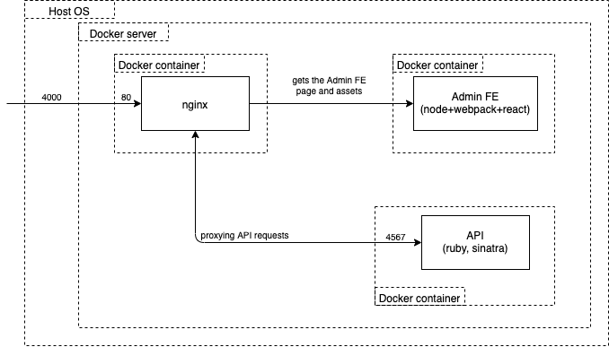
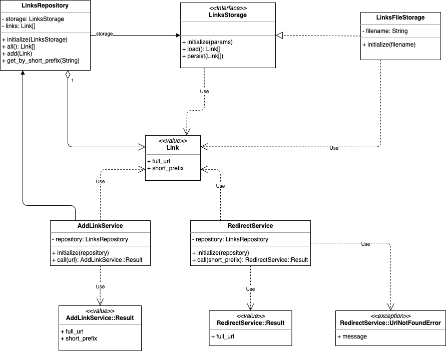
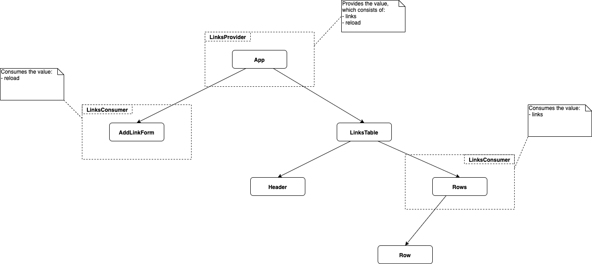
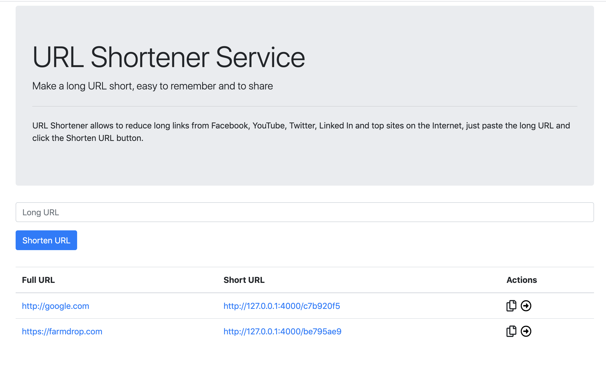

# Url Shortener Code Test

Without using an external database, we'd like you to create a URL shortening
service. The URLs do not need to persist between restarts, but should be
shareable between different clients while the server is running.

- There should be an endpoint that responds to `POST` with a json body
  containing a URL, which responds with a JSON repsonse of the short url and
  the orignal URL, as in the following curl example:

```
curl localhost:4000 -XPOST -d '{ "url": "http://www.farmdrop.com" }'
{ "short_url": "/abc123", "url": "http://www.farmdrop.com" }
```


- When you send a GET request to a previously returned URL, it should redirect
  to the POSTed URL, as shown in the following curl example:

```
curl -v localhost:4000/abc123
...
< HTTP/1.1 301 Moved Permanently
...
< Location: http://www.farmdrop.com
...
{ "url": "http://www.farmdrop.com" }
```

Use whatever languages and frameworks you are comfortable with. Don't worry
about getting the whole thing working flawlessly, this is more to see how you
structure a program. Please don't spend more than a few hours on it.

Bonus points:

- I often forget to type "http://" at the start of a URL. It would be nice if
  this was handled by the application (frontend or backend is up to you).
- We like to see how you approach the problem, so a few git commits with a
  clear message about what you're doing are better than one git commit with
  everything in it.
- We like tests. We don't expect a full test suite, but some tests would be
  nice to see. Its up to you whether thats integration, unit or some other
  level of testing.
- We'd be very happy to see a Dockerfile to run the project. This by no means a
  requirement, so don't go reading the Docker docs if you've never worked with
  it.
- If you'd like to show off your frontend skills, you could create a simple
  frontend that can create and display shortened URLs without reloading the
  page.

## Submission

Please clone this repository, write some code and update this README with a
guide of how to run it.

Either send us a link to the repository on somewhere like github or bitbucket
(bitbucket has free private repositories) or send us a git bundle.

    git bundle create yournamehere-url-shortener-test.bundle master

And send us the resulting `yournamehere-url-shortener-test.bundle` file.

This `.bundle` file can be cloned using:

    git bundle clone bundle-filename.bundle -b master directory-name

## Solution

### Architecture&Design

#### Infrastructure

From the infrastructure point of view the solution consists of the following components:

- nginx - the reverse proxy service, which stays on top of all other service and hides them
- admin fe - the service, which provides the frontend part of the solution.
  Essentially, it's the React.js application, which uses the API service in
order to show available links and add new ones.
- api - the service, which provides the facilities to keep short links, add new
  ones and perform redirect to the original URL



#### API service design

The class diagram of the API service is presented below:



#### Admin FE service design

The Admin FE service is implemented as a React.js application, which could be
represented as a tree of the components presented below:




### Usage

The solution could be run in one of the available modes:

- dev
- prod

The main difference between them is that the `dev` mode provides the ability to
develop services in a more convenient way providing features such as:

- no need to rebuild images after code changes
- live reloading (no need to restart containers after code changes).

The features of the `prod` mode:

- the links will be persisted even if containers are recreated
- in a case of some error the API service provides the JSON response with the
  corresponding HTTP status instead of the 500 response (it depends on how the
Sinatra works in dev/prod modes respectfully)

To easily run all services in docker containers and configure them the
solution leverages the docker-compose utility. There are two files with the
configuration for the `docker-compose` utility in order to run the solution
differently based on the target mode. To make the usage process more flawless
and convenient there is a custom script `composer` - you have to specify in
which mode you want to run/build the solution and other docker compose
arguments and all the magic does the script for you. In general, the schema how to run the `composer` script looks like this:

```
$ ./composer <target-env> <other-docker-compose-arguments>
```

Let's consider some of the examples.

Build all services in dev mode:

```
$ ./composer dev build
Building api
Step 1/10 : FROM ruby:2.5
 ---> 54cb86b0bcdc
Step 2/10 : ENV APP_HOME /app
 ---> Using cache
 ---> a2e0af5d7fd0
Step 3/10 : RUN apt-get update -qq && apt-get install -y build-essential
 ---> Using cache
 ---> f418efd11b48
Step 4/10 : RUN mkdir $APP_HOME
 ---> Using cache
 ---> 78d1994b1503
Step 5/10 : RUN mkdir $APP_HOME/storage
 ---> Using cache
 ---> 4384083937e2
Step 6/10 : WORKDIR $APP_HOME
 ---> Using cache
 ---> 80d09fd38bfa
Step 7/10 : COPY Gemfile* ./
 ---> Using cache
 ---> 6c5435c3c81f
Step 8/10 : RUN bundle install --without development test
 ---> Using cache
 ---> 7869eec41bd8
Step 9/10 : COPY . ./
 ---> Using cache
 ---> 5f6390d44f04
Step 10/10 : CMD ["bundle", "exec", "puma", "-C", "puma.rb"]
 ---> Using cache
 ---> 5bcc5a8150b3

Successfully built 5bcc5a8150b3
Successfully tagged url-shortener-dev_api:latest
Building admin
Step 1/8 : FROM node:10.18.0
 ---> ea119cebc1c3
Step 2/8 : ENV APP_HOME /app
 ---> Using cache
 ---> a0614bf4310f
Step 3/8 : RUN mkdir -p $APP_HOME
 ---> Using cache
 ---> 4e4b2ba01bee
Step 4/8 : WORKDIR /app
 ---> Using cache
 ---> d330d61b3022
Step 5/8 : COPY package.json package-lock.json ./
 ---> Using cache
 ---> bb44d72b9a4d
Step 6/8 : RUN npm i
 ---> Using cache
 ---> c312560b0f4e
Step 7/8 : COPY . ./
 ---> Using cache
 ---> 24fb6a7f3ecb
Step 8/8 : CMD ["npm", "run", "build"]
 ---> Using cache
 ---> 2d1d88007552

Successfully built 2d1d88007552
Successfully tagged url-shortener-dev_admin:latest
Building nginx
Step 1/6 : FROM nginx:1.16.1
 ---> 64f1f7d81bd8
Step 2/6 : COPY entrypoint.sh /sbin
 ---> Using cache
 ---> 2c6ddb27428b
Step 3/6 : COPY nginx.conf.* /tmp/
 ---> Using cache
 ---> 6a05b82fc458
Step 4/6 : RUN mkdir -p /usr/share/nginx/html/admin-service
 ---> Using cache
 ---> d542b3a93c49
Step 5/6 : ENTRYPOINT ["/sbin/entrypoint.sh"]
 ---> Using cache
 ---> 0f170aad8b54
Step 6/6 : CMD ["run-prod"]
 ---> Using cache
 ---> 8ff0bcd429e7

Successfully built 8ff0bcd429e7
Successfully tagged url-shortener-dev_nginx:latest

$ docker images | grep dev
url-shortener-dev_admin    latest              2d1d88007552        19 hours ago        987MB
url-shortener-dev_nginx    latest              8ff0bcd429e7        24 hours ago        126MB
url-shortener-dev_api      latest              5bcc5a8150b3        24 hours ago        874MB
```

Please, notice that the images built for the `dev` mode will have the `dev` tag
inside names. The images built for the `prod` mode will have the `prod` tag
correspondingly.

Run the whole solution:

```
$ ./composer dev up
Starting url-shortener-dev_api_1     ... done
Starting url-shortener-dev_nginx_1   ... done
Recreating url-shortener-dev_admin_1 ... done
Attaching to url-shortener-dev_nginx_1, url-shortener-dev_api_1, url-shortener-dev_admin_1
api_1    | [1] Puma starting in cluster mode...
api_1    | [1] * Version 4.3.1 (ruby 2.5.7-p206), codename: Mysterious Traveller
api_1    | [1] * Min threads: 5, max threads: 5
api_1    | [1] * Environment: development
api_1    | [1] * Process workers: 1
api_1    | [1] * Phased restart available
api_1    | [1] * Listening on tcp://0.0.0.0:4567
api_1    | [1] Use Ctrl-C to stop
admin_1  |
admin_1  | > admin-service@1.0.0 dev-server /app
admin_1  | > webpack-dev-server --config ./webpack/webpack.config.dev.js
admin_1  |
api_1    | I, [2020-01-10T08:37:47.096137 #8]  INFO -- : Starts to load links from /tmp/url-shortener-development/urls.csv
api_1    | [1] - Worker 0 (pid: 8) booted, phase: 0
admin_1  | ℹ ｢wds｣: Project is running at http://0.0.0.0:8080/
admin_1  | ℹ ｢wds｣: webpack output is served from /
admin_1  | ℹ ｢wds｣: Content not from webpack is served from /app/dist
admin_1  | ℹ ｢wds｣: 404s will fallback to /index.html
admin_1  | ℹ ｢wdm｣: Hash: 6966ee2338c7a50a4db8
admin_1  | Version: webpack 4.41.5
admin_1  | Time: 9063ms
admin_1  | Built at: 01/10/2020 8:38:07 AM
admin_1  |      Asset       Size  Chunks             Chunk Names
admin_1  |  bundle.js   2.81 MiB    main  [emitted]  main
admin_1  | index.html  703 bytes          [emitted]
admin_1  | Entrypoint main = bundle.js
admin_1  | [0] multi (webpack)-dev-server/client?http://0.0.0.0:8080 ./src/index.js 40 bytes {main} [built]
admin_1  | [./node_modules/bootstrap/dist/css/bootstrap.css] 562 bytes {main} [built]
admin_1  | [./node_modules/react-dom/index.js] 1.33 KiB {main} [built]
admin_1  | [./node_modules/react/index.js] 190 bytes {main} [built]
admin_1  | [./node_modules/strip-ansi/index.js] 161 bytes {main} [built]
admin_1  | [./node_modules/webpack-dev-server/client/index.js?http://0.0.0.0:8080] (webpack)-dev-server/client?http://0.0.0.0:8080 4.29 KiB {main} [built]
admin_1  | [./node_modules/webpack-dev-server/client/overlay.js] (webpack)-dev-server/client/overlay.js 3.51 KiB {main} [built]
admin_1  | [./node_modules/webpack-dev-server/client/socket.js] (webpack)-dev-server/client/socket.js 1.53 KiB {main} [built]
admin_1  | [./node_modules/webpack-dev-server/client/utils/createSocketUrl.js] (webpack)-dev-server/client/utils/createSocketUrl.js 2.91 KiB {main} [built]
admin_1  | [./node_modules/webpack-dev-server/client/utils/log.js] (webpack)-dev-server/client/utils/log.js 964 bytes {main} [built]
admin_1  | [./node_modules/webpack-dev-server/client/utils/reloadApp.js] (webpack)-dev-server/client/utils/reloadApp.js 1.59 KiB {main} [built]
admin_1  | [./node_modules/webpack-dev-server/client/utils/sendMessage.js] (webpack)-dev-server/client/utils/sendMessage.js 402 bytes {main} [built]
admin_1  | [./node_modules/webpack/hot sync ^\.\/log$] (webpack)/hot sync nonrecursive ^\.\/log$ 170 bytes {main} [built]
admin_1  | [./src/components/App.js] 330 bytes {main} [built]
admin_1  | [./src/index.js] 214 bytes {main} [built]
admin_1  |     + 94 hidden modules
admin_1  | Child html-webpack-plugin for "index.html":
admin_1  |      1 asset
admin_1  |     Entrypoint undefined = index.html
admin_1  |     [./node_modules/html-webpack-plugin/lib/loader.js!./src/assets/index.html] 917 bytes {0} [built]
admin_1  |     [./node_modules/lodash/lodash.js] 528 KiB {0} [built]
admin_1  |     [./node_modules/webpack/buildin/global.js] (webpack)/buildin/global.js 472 bytes {0} [built]
admin_1  |     [./node_modules/webpack/buildin/module.js] (webpack)/buildin/module.js 497 bytes {0} [built]
admin_1  | ℹ ｢wdm｣: Compiled successfully.
```

Once the solution is run, please, visit the `http://127.0.0.1:4000/admin/` to
see the Admin FE with abilities to see all available links and add new ones.



Additionally, you can send requests to the API service using, for instance, the
`curl` console utility. Please, consider the next possible usage cases of the API service:

##### Get all links

```
$ curl -v http://localhost:4000/api/urls
*   Trying ::1...
* TCP_NODELAY set
* Connected to localhost (::1) port 4000 (#0)
> GET /api/urls HTTP/1.1
> Host: localhost:4000
> User-Agent: curl/7.54.0
> Accept: */*
>
< HTTP/1.1 200 OK
< Server: nginx/1.16.1
< Date: Fri, 10 Jan 2020 08:46:06 GMT
< Content-Type: application/json
< Content-Length: 122
< Connection: keep-alive
< X-Content-Type-Options: nosniff
<
* Connection #0 to host localhost left intact
[{"full_url":"http://google.com","short_prefix":"c7b920f5"},{"full_url":"https://farmdrop.com","short_prefix":"be795ae9"}]%
```

##### Send a proper request to add new link

```
$ curl -vX POST http://localhost:4000/api/urls -H 'Content-Type: application/json' -d '{"url": "google.com"}'
*   Trying ::1...
* TCP_NODELAY set
* Connected to localhost (::1) port 4000 (#0)
> POST /api/urls HTTP/1.1
> Host: localhost:4000
> User-Agent: curl/7.54.0
> Accept: */*
> Content-Type: application/json
> Content-Length: 21
>
* upload completely sent off: 21 out of 21 bytes
< HTTP/1.1 200 OK
< Server: nginx/1.16.1
< Date: Fri, 10 Jan 2020 08:50:17 GMT
< Content-Type: application/json
< Content-Length: 51
< Connection: keep-alive
< X-Content-Type-Options: nosniff
<
* Connection #0 to host localhost left intact
{"short_url":"/c7b920f5","url":"http://google.com"}%
```

##### Send an empty body to add new link

```
$ curl -vX POST http://localhost:4000/api/urls -H 'Content-Type: application/json' -d '{}'
*   Trying ::1...
* TCP_NODELAY set
* Connected to localhost (::1) port 4000 (#0)
> POST /api/urls HTTP/1.1
> Host: localhost:4000
> User-Agent: curl/7.54.0
> Accept: */*
> Content-Type: application/json
> Content-Length: 2
>
* upload completely sent off: 2 out of 2 bytes
< HTTP/1.1 422 Unprocessable Entity
< Server: nginx/1.16.1
< Date: Fri, 10 Jan 2020 08:51:09 GMT
< Content-Type: application/json
< Content-Length: 52
< Connection: keep-alive
< X-Content-Type-Options: nosniff
<
* Connection #0 to host localhost left intact
{"errors":["The parameter `url` has to be filled!"]}%
```

##### Call the redirect endpoint with an existing short prefix

```
$ curl -v http://localhost:4000/api/redirect\?short_prefix\=c7b920f5
*   Trying ::1...
* TCP_NODELAY set
* Connected to localhost (::1) port 4000 (#0)
> GET /api/redirect?short_prefix=c7b920f5 HTTP/1.1
> Host: localhost:4000
> User-Agent: curl/7.54.0
> Accept: */*
>
< HTTP/1.1 301 Moved Permanently
< Server: nginx/1.16.1
< Date: Fri, 10 Jan 2020 08:56:43 GMT
< Content-Type: text/html;charset=utf-8
< Content-Length: 0
< Connection: keep-alive
< Location: http://google.com
< X-XSS-Protection: 1; mode=block
< X-Content-Type-Options: nosniff
< X-Frame-Options: SAMEORIGIN
<
* Connection #0 to host localhost left intact
```

##### Call the redirect endpoint with the short prefix which does not exist

```
$ curl -v http://localhost:4000/api/redirect\?short_prefix\=prefix
*   Trying ::1...
* TCP_NODELAY set
* Connected to localhost (::1) port 4000 (#0)
> GET /api/redirect?short_prefix=prefix HTTP/1.1
> Host: localhost:4000
> User-Agent: curl/7.54.0
> Accept: */*
>
< HTTP/1.1 404 Not Found
< Server: nginx/1.16.1
< Date: Fri, 10 Jan 2020 08:59:05 GMT
< Content-Type: application/json
< Content-Length: 80
< Connection: keep-alive
< X-Content-Type-Options: nosniff
<
* Connection #0 to host localhost left intact
{"errors":["The URL associated with the short prefix `prefix` does not exist!"]}%
```

##### Call the redirect endpoint via the root path

```
$ curl -v http://localhost:4000/c7b920f5
*   Trying ::1...
* TCP_NODELAY set
* Connected to localhost (::1) port 4000 (#0)
> GET /c7b920f5 HTTP/1.1
> Host: localhost:4000
> User-Agent: curl/7.54.0
> Accept: */*
>
< HTTP/1.1 301 Moved Permanently
< Server: nginx/1.16.1
< Date: Fri, 10 Jan 2020 09:02:13 GMT
< Content-Type: text/html;charset=utf-8
< Content-Length: 0
< Connection: keep-alive
< Location: http://google.com
< X-XSS-Protection: 1; mode=block
< X-Content-Type-Options: nosniff
< X-Frame-Options: SAMEORIGIN
<
* Connection #0 to host localhost left intact
```
